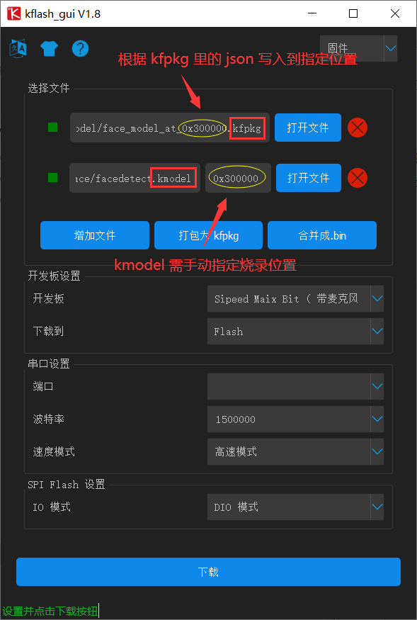
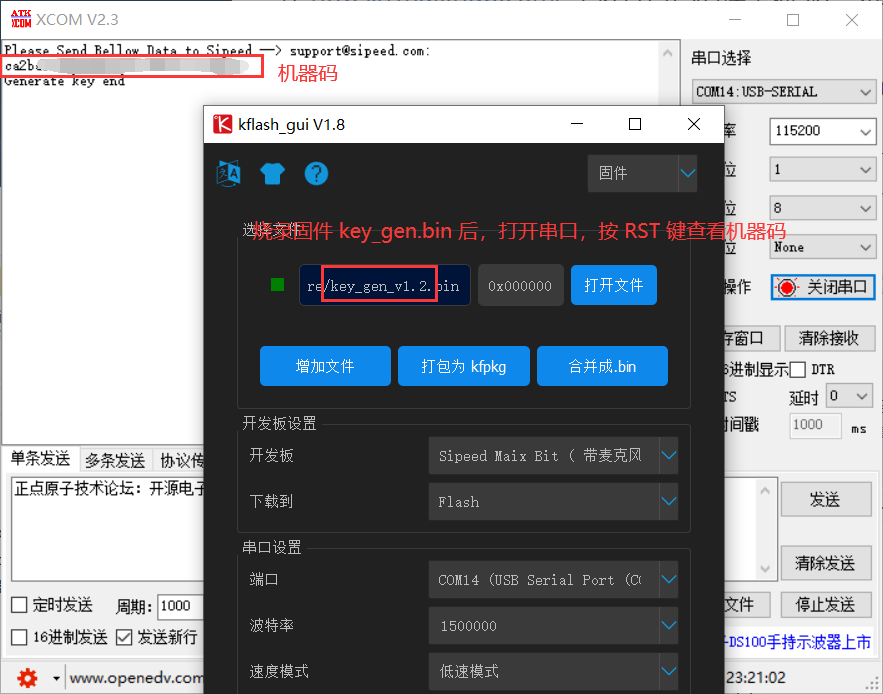

### 模型烧录

* 复制到 tfcard 里

直接将  `kmodel` / `smodel` 复制到 `tfcard` 里即可

* 烧录到 flash 里

`kfpkg` 是由 `kmodel` 和 `json` （记录了 `kmodel` 的烧录位置）的打包文件（可使用解压软件打开）。烧录到 `flash` 里的位置不是固定的，可以自定义。

### 模型加载

maixpy 中，有 2 种加载方式：

1. 从 `Flash` 中加载：kpu.load(addr)
2. 从 `TF卡` 中加载：kpu.load("/sd/xxx.kmodel") 或 kpu.load("/sd/xxx.smodel")

### 模型训练

在 https://maixhub.com/ 中进行自己的模型训练，或者下载别人已经训练好的模型。（需烧录 `key_gen` 固件以获取机器码，注：`smodel` 绑定了机器码，换机器需要重新换机器码，即需在 https://maixhub.com/ 重新下载模型）

